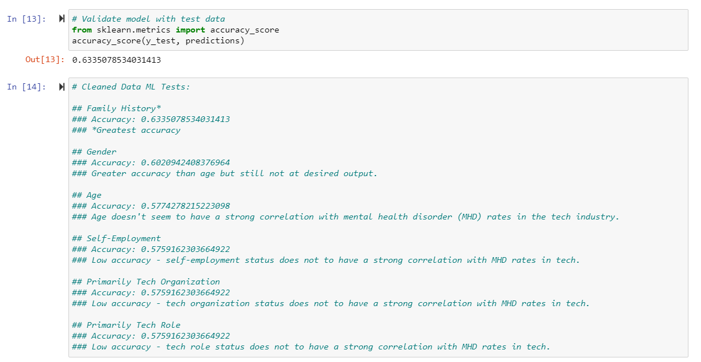
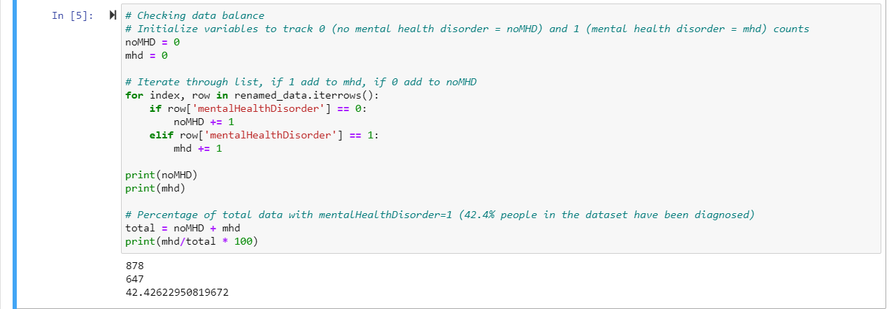

# Mental Health Machine Learning 

## Presentation
Topic: Determining the presence of a mental health disorder in individuals working in the Tech Industry.

- Within our team we have some knowledge and interest in behavioral sciences. We originally wanted to determine if a 
college student has depression based on their major of study. We quickly learned that kind of data was not attainable 
and started searching for a different data set still involving depression. We found a data set involving mental illness
in the Tech industry and found that even more interesting than our original topic.
- We found our data sets through Kaggle under “OSMI Mental Health in Tech Survey.” We decided to look at the datasets for years
2017 through 2019 because the columns were identical to one another.
- With this data we hope to build a machine learning model that will determine if an individual in the Tech industry has
a mental illness.
- We chose to filter through columns that would give us insight into the cause of a mental illness in the workplace and not questions asking about how the workplace caters to people with mental illnesses. The string values also had to be changed to binary outcomes or numerical outcomes.
- We chose a logistic regression model splitting our data into 80 percent training and 20 pecent testing. 
- Our data gave us an accuracy score of 63 percent. Family history seemed to have the greatest influence on mental illness.
- Python in Jupyter Notebooks, Tableau, Excel, Flask, D3.js has all been used in this analysis.
https://docs.google.com/presentation/d/1GDjIcSQ9aAUYrfBP5Oo42hqBygchMrgVO4kj3atX4jc/edit?usp=sharing

## Machine Learning Model

We chose a logistic regression for our machine learning model as our desired dependent variable output is categorical and binary: whether or not a variable can predict the presence of a mental health disorder diagnosis for individuals in the tech industry (1 or 0). Such a model has the potential to provide correlations that could significantly impact the understanding of mental health disorders as they relate to the tech industry. However, we are also limited by the binary output of the algorithm. There are many different mental health disorders and providing only a yes or no output does not fully capture the story. If we had more time, we would have loved to attempt a multiple categorical output regression that is able to predict which mental health disorder an individual in the tech industry might have been diagnosed with. This could prove to be very beneficial in determining what potentially causes such disorders with employees in the tech industry. 

In order for the model to effectively predict accuracy with the data, the data first has to be cleaned and modified. The columns needed throughout the testing of this model were Family History, Gender, Age, Self-Employment Status, Tech Organization Status, Tech Role Status, and Mental Health Disorder Diagnosis Status. 

All columns pertaining to these variables had to be converted to a numerical output. That meant converting Gender, Self-Employment Status, and Mental Health Disorder Diagnosis Status to a single numerical value (i.e. 1 or 0 for present or absent). We chose these variables as we hypothesized they have the strongest correlation with mental health in the tech industry. Gender and Age have been factors of influence in many other industries and communities, and whether an individual is self-employed or not may affect how happy they are in their position and with their work. 

Whether or not the individual has a family history of mental illness provided the strongest correlation with whether or not the individual has been diagnosed with a mental health disorder, with an accuracy of about 0.634. Though we weren't able to find stronger correlations within this dataset, we hope to continue to utilize this model on other datasets with different variables to continue to analyze what factors may impact an employees mental health status.

The data was split into a training set and a testing set with 80 percent and 20 percent of the data, respectively. The dependent variables used were Age, Self-Employment Status, and Gender. The independent variable used was Mental Health Disorder Diagnosis Status. The data was also balanced with 42.4% of the sample in the dataset haveing been diagnosed with a mental health disorder.

## Dashboard
- Storyboard of google slides. 
- We are using a Flask template along with D3.js to create a fully functioning and interactive dashboard. 
- A description of our topic and model will be at the top of the page. 
- We have our dataset in a table along with a way to filter the data based on year, gender, self-employment,
and company size. 
- Graphs and pictures of our analysis to help visualize our findings.
